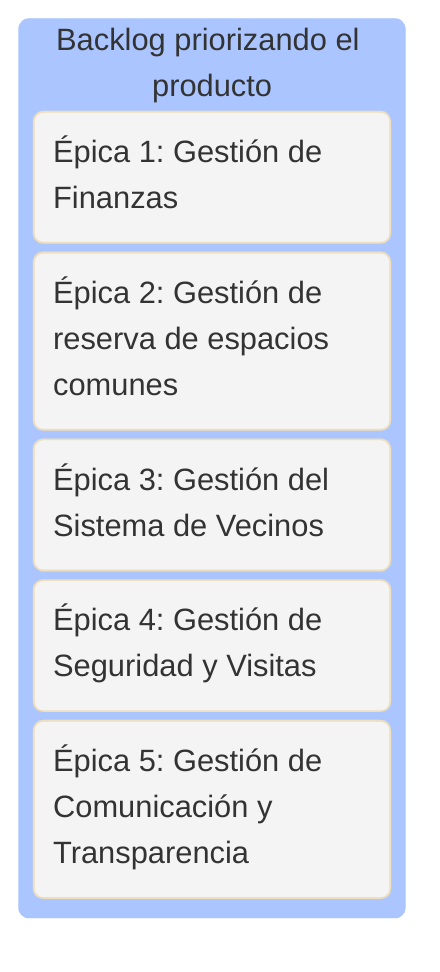
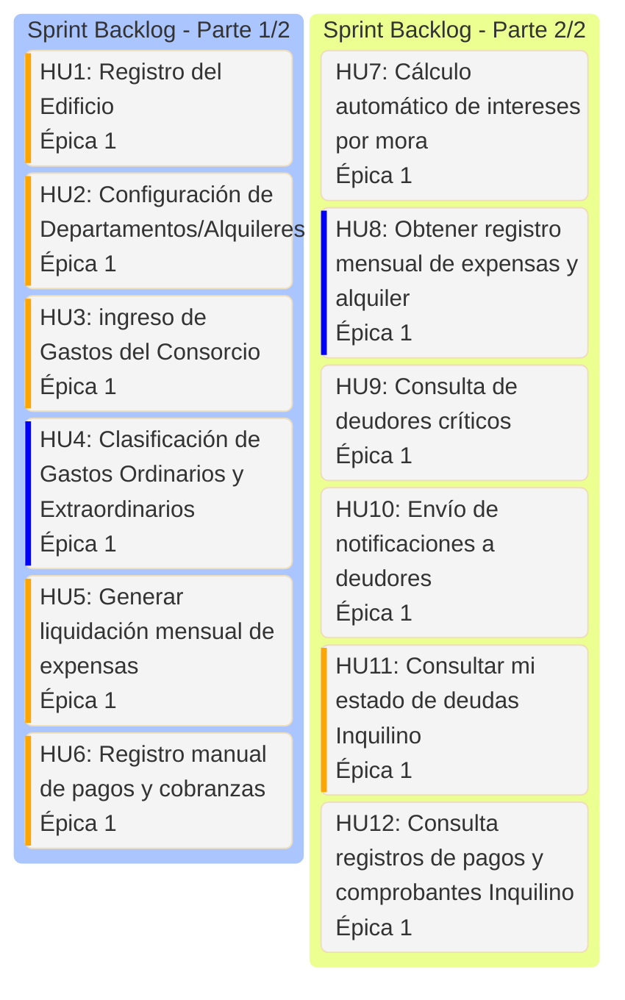
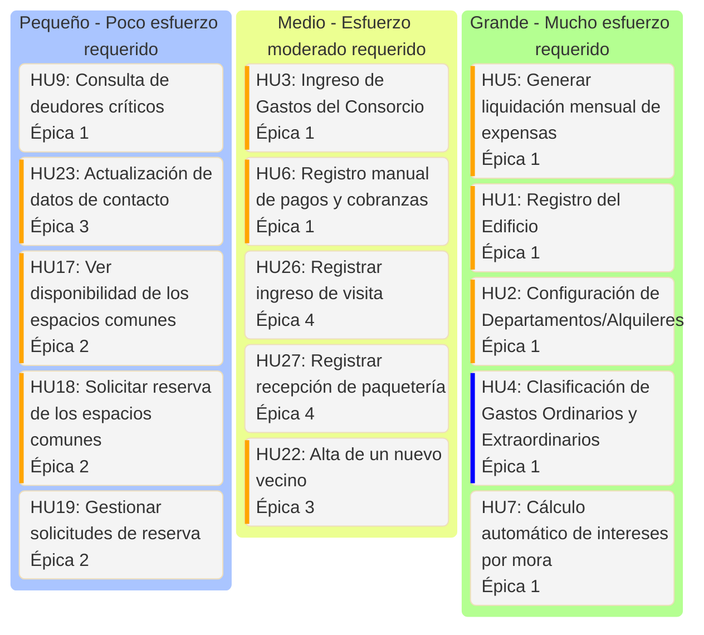

grafico 1

```mermaid
---
config:
  kanban:
    ticketBaseUrl: https://mermaidchart.atlassian.net/browse/#TICKET#
  theme: base
---
kanban
    [Backlog priorizando el producto]
        [Épica 1: Gestión de Finanzas]
        [Épica 2: Gestión de reserva de espacios comunes]
        [Épica 3: Gestión del Sistema de Vecinos]
        [Épica 4: Gestión de Seguridad y Visitas]
        [Épica 5: Gestión de Comunicación y Transparencia]
    
```

grafico 2 y 3

```mermaid
---
config:
    theme: base
---
kanban
    [Sprint Backlog - Parte 1/2]
        [HU1: Registro del Edificio]@{ priority: "High", ticket: "Épica 1" }
        [HU2: Configuración de Departamentos/Alquileres]@{ priority: "High", ticket: "Épica 1" }
        [HU3: ingreso de Gastos del Consorcio]@{ priority: "High", ticket: "Épica 1" }
        [HU4: Clasificación de Gastos Ordinarios y Extraordinarios]@{ priority: "Low", ticket: "Épica 1" }
        [HU5: Generar liquidación mensual de expensas]@{ priority: "High", ticket: "Épica 1" }
        [HU6: Registro manual de pagos y cobranzas]@{ priority: "High", ticket: "Épica 1" }
    
    [Sprint Backlog - Parte 2/2]
        [HU7: Cálculo automático de intereses por mora]@{ ticket: "Épica 1" }
        [HU8: Obtener registro mensual de expensas y alquiler]@{ priority: "Low", ticket: "Épica 1" }
        [HU9: Consulta de deudores críticos]@{ ticket: "Épica 1" }
        [HU10: Envío de notificaciones a deudores]@{ ticket: "Épica 1" }
        [HU11: Consultar mi estado de deudas Inquilino]@{ priority: "High", ticket: "Épica 1" }
        [HU12: Consulta registros de pagos y comprobantes Inquilino]@{ ticket: "Épica 1" }
```

```mermaid
---
config:
  theme: base
---
kanban
    [Pequeño - Poco esfuerzo requerido]
        [HU9: Consulta de deudores críticos]@{ticket: "Épica 1", priority: "Medium"}
        [HU23: Actualización de datos de contacto]@{ticket: "Épica 3", priority: "High"}
        [HU17: Ver disponibilidad de los espacios comunes]@{ticket: "Épica 2", priority: "High"}
        [HU18: Solicitar reserva de los espacios comunes]@{ticket: "Épica 2", priority: "High"}
        [HU19: Gestionar solicitudes de reserva]@{ticket: "Épica 2", priority: "Medium"}
        %%[HU28: Confirmar retiro de paquete]@{ticket: "Épica 4"}
        %%[HU29: Publicar un comunicado general]@{ticket: "Épica 5"}
        %%[HU31: Enviar consulta directa a la administración]@{ticket: "Épica 5"}
        %%[HU30: Consultar documentos del consorcio]@{ticket: "Épica 5"}
        %%[HU10: Envío de notificaciones a deudores]@{ticket: "Épica 1", priority: "Low"}
        %%[HU11: Consultar mi estado de deudas Inquilino]@{ticket: "Épica 1", priority: "High"}
        %%[HU14: Subir archivo comprobante de transferencia Inquilino]@{ticket: "Épica 1", priority: "Low"}
        %%[HU16: Confirmar pago por transferencia]@{ticket: "Épica 1", priority: "Low"}
        %%[HU12: Consulta registros de pagos y comprobantes Inquilino]@{ticket: "Épica 1"}
    [Medio - Esfuerzo moderado requerido]
        [HU3: Ingreso de Gastos del Consorcio]@{ticket: "Épica 1", priority: "High" }
        [HU6: Registro manual de pagos y cobranzas]@{ticket: "Épica 1", priority: "High"}
        [HU26: Registrar ingreso de visita]@{ticket: "Épica 4"}
        [HU27: Registrar recepción de paquetería]@{ticket: "Épica 4"}
        [HU22: Alta de un nuevo vecino]@{ticket: "Épica 3", priority: "High"}
        %%[HU24: Baja o desvinculación de un inquilino]@{ticket: "Épica 3", priority: "High"}
        %%[HU25: Visualización del directorio de residentes]@{ticket: "Épica 3", priority: "Medium"}
        %%[HU20: Cancelar reserva del espacio común]@{ticket: "Épica 2", priority: "High"}
        %%[HU8: Obtener registro mensual de expensas y alquiler]@{ticket: "Épica 1", priority: "Low"}
        %%[HU15: Consultar gastos de expensa mensual - Inquilino]@{ticket: "Épica 1", priority: "High"}
        %%[HU13: Pagar de deudas Online - Inquilino]@{ticket: "Épica 1", priority: "High"}
        %%[HU21: Historial de reservas]@{ticket: "Épica 2", priority: "Low"}
    [Grande - Mucho esfuerzo requerido]
        [HU5: Generar liquidación mensual de expensas]@{ticket: "Épica 1", priority: "High"}
        [HU1: Registro del Edificio]@{ticket: "Épica 1", priority: "High"}
        [HU2: Configuración de Departamentos/Alquileres]@{ticket: "Épica 1", priority: "High"}
        [HU4: Clasificación de Gastos Ordinarios y Extraordinarios]@{ticket: "Épica 1", priority: "Low"}
        [HU7: Cálculo automático de intereses por mora]@{ticket: "Épica 1", priority: "Medium"}
```
